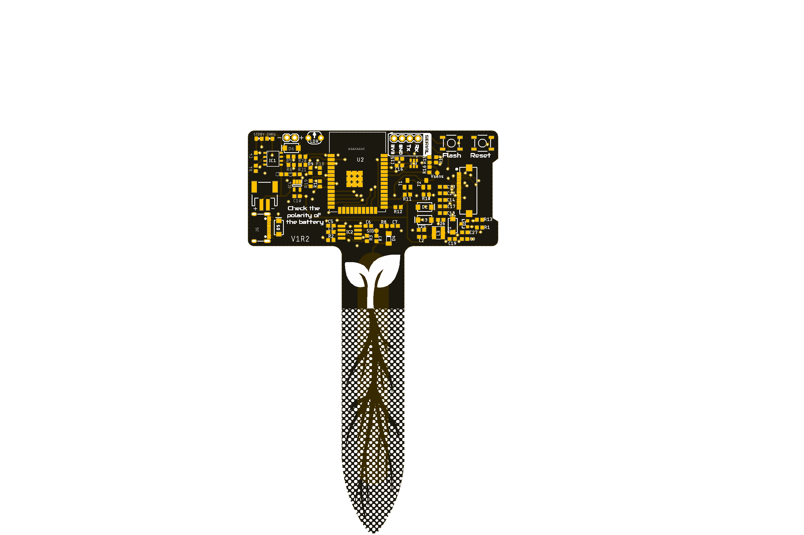

[![Documentation Status][documentation-shield]][documentation]
[![License][license-shield]](LICENSE)
[![Project Maintenance][maintenance-shield]][maintenance]
[![buyit][buyit-shield]][buyit]

# Smart Plant
The Smart Plant is a board that can be plugged directly on the soil, close to the plant, that allows the measurement of the environment (soil moisture, environment temperature & illuminance), and presents the information on an ePaper display.

   
      

## Project tree

<li><a href="./Design/">Design</a></li>
<li><a href="./Documentation/">Documentation</a></li>

<li><a href="./README.md">README.md</a></li>

[documentation-shield]: https://readthedocs.org/projects/smart-plant/badge/?version=v2r1&style=for-the-badge
[documentation]: https://smart-plant.readthedocs.io/

[license-shield]: https://img.shields.io/badge/License-CC%20BY--NC--SA%204.0-lightgrey.svg?style=for-the-badge

[maintenance-shield]: https://img.shields.io/badge/maintainer-J.%20G.%20Aguado-2e48a7.svg?style=for-the-badge
[maintenance]: https://github.com/JGAguado

[buyit-shield]: https://img.shields.io/badge/get%20it%20on-elecrow-399BD7.svg?style=for-the-badge
[buyit]: https://www.elecrow.com/smart-plant.html
