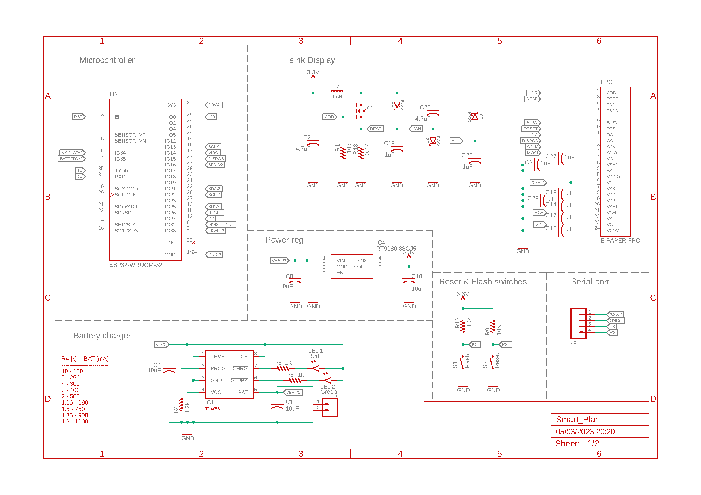
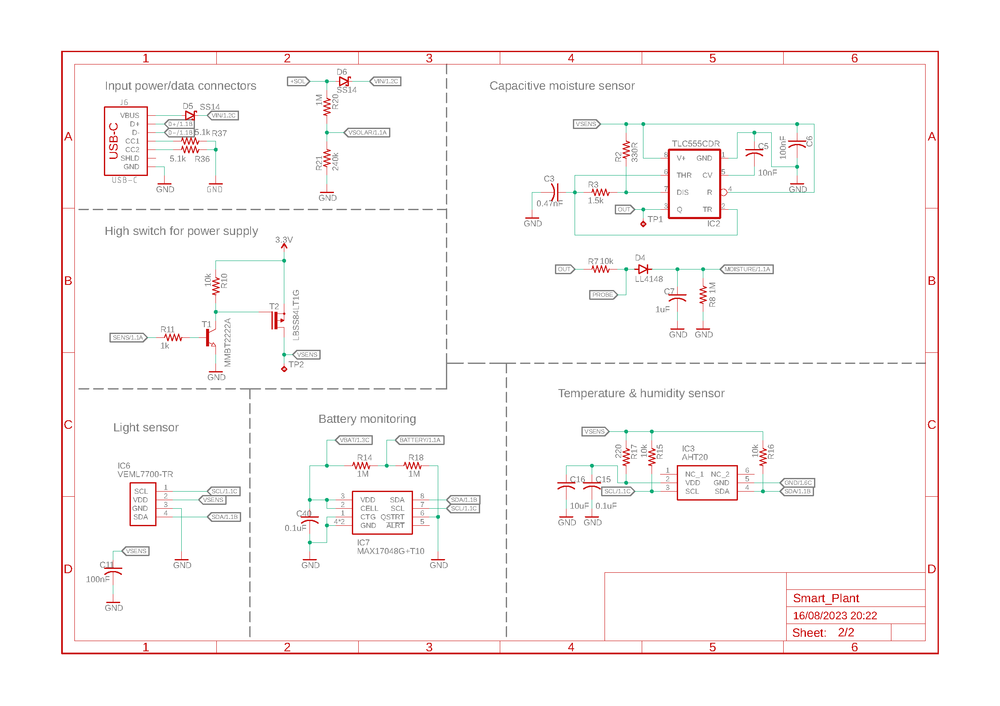
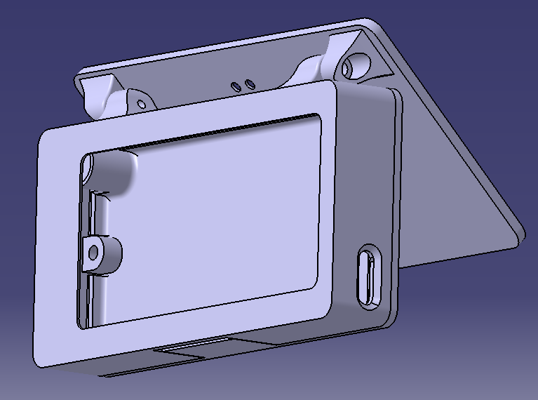

Schematics and drawings
=======================

Electronic schematics
---------------------

:download:`Download PDF <../../Documentation/Schematics/Schematic.pdf>`

.. _pcb:

:term:`PCB`
----------

.. raw:: html

    <iframe src="_static/ibom.html" height="800px" width="100%"></iframe>

.. _enclosure:
3D printable enclosure
-----------------------
.. image:: images/getting_started/Enclosure.png
    :width: 49%

Standard version
^^^^^^^^^^^^^^^^^
 - :download:`Bottom <../../Enclosure/Smart-Plant Enclosure Bottom.stl>`
 - :download:`Top <../../Enclosure/Smart-Plant Enclosure Top without solar.stl>`
 - :download:`Button <../../Enclosure/Smart-Plant Enclosure ButtonPin.stl>`

Version with solar panel
^^^^^^^^^^^^^^^^^^^^^^^^^
 - :download:`Bottom <../../Enclosure/Smart-Plant Enclosure Bottom.stl>`
 - :download:`Top <../../Enclosure/Smart-Plant Enclosure Top.stl>`
 - :download:`Button <../../Enclosure/Smart-Plant Enclosure ButtonPin.stl>`
 - :download:`Panel <../../Enclosure/Smart Plant Enclosure Solar.stl>`
