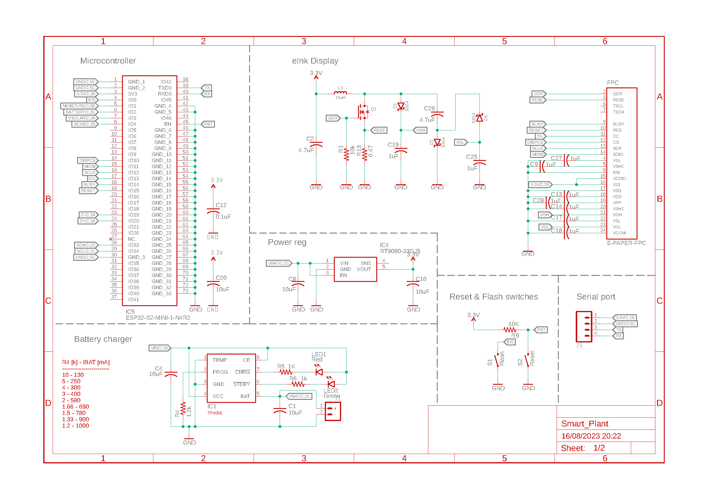

📐 Design
===========================

Electronic schematics
---------------------

.. image:: ../../Documentation/Schematics/Schematic_2.png
    :width: 49%

:download:`Download PDF <../../Documentation/Schematics/Schematic.pdf>`

.. _pcb:

:term:`PCB`
----------

.. raw:: html

    <iframe src="_static/ibom.html" height="800px" width="100%"></iframe>

.. _enclosure:

3D printable enclosure
-----------------------

FDM version
^^^^^^^^^^^^^^^^^
This 3D model is intended to be printed on :term:`FDM` printers. Check your printing configuration for obtaining the best results on ~2mm thick walls.

.. image:: ../../Enclosure/FDM/Render.png
    :width: 49%
    
.. image:: ../../Enclosure/FDM/Render_1.png
    :width: 49%

|

Printable STL files:

- :download:`Bottom STL<../../Enclosure/FDM/Smart-Plant Enclosure Bottom.stl>`
- :download:`Top STL<../../Enclosure/FDM/Smart-Plant Enclosure Top.stl>`

Editable STEP files:

- :download:`Bottom STP<../../Enclosure/FDM/Smart-Plant Enclosure Bottom.stp>`
- :download:`Top STP<../../Enclosure/FDM/Smart-Plant Enclosure Top.stp>`

SLA version
^^^^^^^^^^^^^^^^^
This 3D model is intended to be printed on :term:`SLA` printers. 
If you want to use transparent resins, you can download the *Top transparent* version, without holes for the sensor or the display.

    

|

Printable STL files:

- :download:`Bottom STL<../../Enclosure/SLA/Smart-Plant Enclosure Bottom.stl>`
- :download:`Top STL<../../Enclosure/SLA/Smart-Plant Enclosure Top.stl>`
- :download:`Top transparent STL<../../Enclosure/SLA/Smart-Plant Enclosure Top - Transparent.stl>`

Editable STEP files:

- :download:`Bottom STP<../../Enclosure/SLA/Smart-Plant Enclosure Bottom.stp>`
- :download:`Top STP<../../Enclosure/SLA/Smart-Plant Enclosure Top.stp>`
- :download:`Top transparent STP<../../Enclosure/SLA/Smart-Plant Enclosure Top - Transparent.stp>`

Community's versions
^^^^^^^^^^^^^^^^^^^^^^

- `@Paulomart <https://github.com/Paulomart>`_ created a more streamlined button operation version for the bottom part. Check it out on `Printables <https://www.printables.com/de/model/745390-smart-plant-bottom-enclosure-with-improved-buttons>`_.

.. image:: https://media.printables.com/media/prints/745390/images/5824027_fd714d4d-da38-4658-af41-c73c53df3433_d8d7018c-166e-40a0-8fd8-d4adc773e110/thumbs/inside/1920x1440/jpeg/img_7507.webp
    :width: 49%
  

Technical Specifications
-------------------------

Microcontroller 
^^^^^^^^^^^^
.. list-table:: 
    :widths: 50 80
    :stub-columns: 1

    * - Module
      - ESP32-S2-MINI-1
    * - SoC
      - Xtensa® singlecore 32-bit LX7 up to 240MHz
    * - Flash
      - 4MB
    * - PSRAM
      - 2MB

Power
^^^^^^^^^^^^

.. list-table:: 
    :widths: 50 80
    :stub-columns: 1

    * - Battery 
      - LiPo 3.7 V 1000 mAh
    * - Input (USB/Solar panel)
      - 5V @ 500mA

Features
^^^^^^^^^^^^

.. list-table:: 
    :widths: 50 80
    :stub-columns: 1

    * - Interface 
      - USB Type C 
    * - 
      - 2.4GHz WiFi 
    * - 
      - UART
    * - Display
      - 2.9" e-paper 
    * - Sensors
      - Capacitive soil moisture probe (analog)
    * - 
      - VEML7700-TR illuminance sensor (digital :math:`I^2C`)
    * - 
      - AHT20 air temperature & relative humidity sensor (digital :math:`I^2C`)
    * - 
      - MAX17048 battery voltage level sensor (digital :math:`I^2C`)

Dimensions
^^^^^^^^^^^^

.. list-table:: 
    :widths: 50 80
    :stub-columns: 1

    * - Size 
      - 130x80x7mm
    * - 
      - 132x84x15mm with enclosure
    * - Weight
      - 20g
    * - 
      - 45g with battery

Environment
^^^^^^^^^^^^
.. Caution::
    If the |Product| is placed on the soil close to the plant, be careful at the moment of wattering your plant: avoid splashes 
    or flooding the pot.

.. list-table:: 
    :widths: 50 20 20 20 20 20
    :header-rows: 1
    :stub-columns: 1

    * - Parameter
      - Symbol
      - Min.
      - Typ.
      - Max.
      - Unit
    * - Working temperature [1]_
      - :math:`T_{amb}`
      - 0
      - 25 
      - 60
      - *°C*
    * - Storage temperature [1]_
      - :math:`T_{amb}`
      - 0
      - 25 
      - 60
      - *°C*

.. [1] Based on components datasheets.