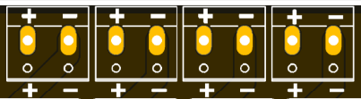
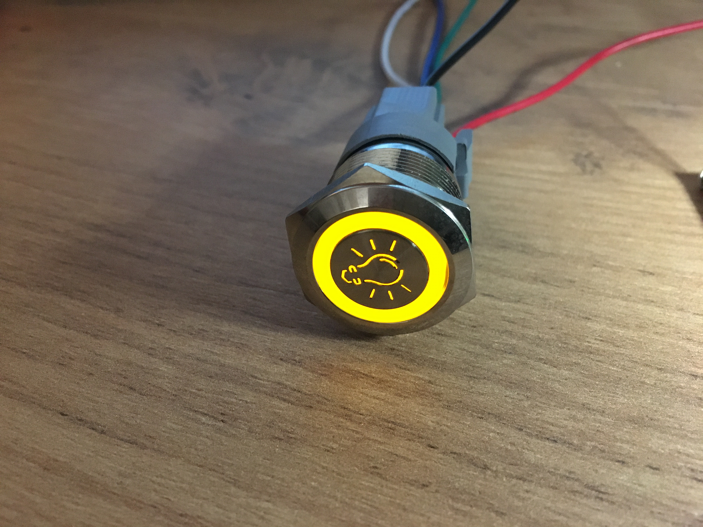

Getting started
===============

Assembly 
----------
Due to the high ammount of components integrated in such small PCB layout, most of them are too small to be soldered at home by you. Therefore, these boards come already 
with the components assembled. 

If you acquired the fully assemble kit, you can skip this section. 

If you selected just the assembled board, you will need to get on your own some other parts to assemble a fully operational |Product|:
 * A 2.9" e-paper display. The recommend (and tested working) e-ink panel is the `Waveshare 2.9" V2 <https>`_ that you can order directly on the manufacturer. Please note that **other 
 displays may not work at all**.
 * A :term:`LiPo` battery, with a recommended 1000mAh capacity, for space and power. The ideal dimensions shouldn't excess the 50x30x5mm in order to fit in the designed enclosure.
 * An enclosure where to fit the |Product| upper part, you can find the 3D printables files on the :ref:`enclosure` section.
 * Optionally, you can mount a solar panel that charges the battery under the right sunny conditions. The output voltage of the panel musn't excess the 6V and the recommended size to fit in the designed enclosure
 is 80x48mm

Powering
--------
The |Product| is be powered through a :term:`LiPo` battery plugged into the white JST connector. The voltage of the battery is reduced to the working 3.3V through a low-consumpiton LDO.

.. Caution::
    Connect the battery after clamping the e-paper connector

In order to charge the battery, there is a battery management IC that provides the right charging curve to the :term:`LiPo` battery and offers a visual indicator (red LED for charging, 
green LED for standby) while the battery is being charged. There are two ways of charging the |Product|: USB-C and solar panel.

USB-C
^^^^^^^^^^^^^
The USB Type-C is a very extended port for portable electronics, and because of it's standarized 5V power supply is ideal for charging the |Product|. Since the battery management IC is designed 
to charge a 1000mAh, there is no need for powerfull USB chargers: any USB-charger capable to deliver 1A will be enough.

.. figure:: images/assembly/usb.png
    :align: center
    :figwidth: 200px

Solar panel
^^^^^^^^^^^^^
In addition to the USB-C, and with the aim of extening the service time between (USB) charges of the battery, the |Product| accepts the voltage input (parallel to the USB) from a solar panel

I/O
-----------
The |Product| supports up to 4 independent *analog outputs*  and 8 *digital inputs/outputs*:

.. _pinout:

.. list-table:: Pinout table
    :widths: 10 10 10 20
    :header-rows: 1

    * - GPIO
      - Input
      - Output
      - Name
    * - 16
      - ✅
      - ✅
      - Auxiliar 1
    * - 17
      - ✅
      - ✅
      - Auxiliar 2
    * - 18
      - ✅
      - ✅
      - Auxiliar 3
    * - 19
      - ✅
      - ✅
      - Auxiliar 4
    * - 23
      - ❌
      - ✅
      - Output 1
    * - 25
      - ❌
      - ✅
      - Output 2
    * - 26
      - ❌
      - ✅
      - Output 3
    * - 27
      - ❌
      - ✅
      - Output 4
    * - 32
      - ✅
      - ❌
      - Input 1
    * - 33
      - ✅
      - ❌
      - Input 2
    * - 34
      - ✅
      - ❌
      - Input 3
    * - 35
      - ✅
      - ❌
      - Input 4

Analog outputs:
^^^^^^^^^^^^^^^^
Each one of these outputs are :term:`PWM` controlled individually through power mosfets.
Despite the PCB layout should allow a correct heat dissipation, an additional heatsink would
be recommendable for applications where a high current is expected (long LED strips or high 
intensity LEDs)

The connection port of each of the outputs is located on the top left part of the board and is done through 
3.5mm screw terminals. The polarity of the connection is defined on the PCB silkscreen.

From left to right, the pin definion of each output is:

:Output 1: *GPIO23*
:Output 2: *GPIO25*
:Output 3: *GPIO26*
:Output 4: *GPIO27*

Digital inputs/outputs:
^^^^^^^^^^^^^^^^^^^^^^^
The connection port of these pins is located on the top right part of the board and is done through 
2.54 pins.

.. figure:: images/assembly/digital_io.png
    :align: right
    :figwidth: 200px

From this set of pins, there are two groups: inputs and auxiliar pins. The difference is that the
input pins are pulled-down through 10k resistors and are connected on the PCB to the pushbuttons. 

:Input 1: *GPIO32*
:Input 2: *GPIO33*
:Input 3: *GPIO34*
:Input 4: *GPIO35*

.. Hint::
    These pins correspond to the ADC_1 (chanels 4-7) of the ESP-32, and therefore can be used as analog
    inputs, always taking into account that are pulled-down already on the board.

    
The auxiliary pins access directly to the microcontroller pins and can behave as digital input/outputs. 
The intention of these auxiliar pins is to control LED rings on pushbuttons that have this feature

:Auxiliar 1: *GPIO16*
:Auxiliar 2: *GPIO17*
:Auxiliar 3: *GPIO18*
:Auxiliar 4: *GPIO19*

Communications
-----------
In addition to the I/O mentioned before, there is also a direct connection to:

:term:`IIC` (:math:`I^2C`) bus:
^^^^^^^^
:SDA: *GPIO21*
:SCL: *GPIO22*

Serial bus:
^^^^^^^^^^^
:Tx: *GPIO1*
:Rx: *GPIO3*

.. _enclosure:

Enclosure
---------
The |Product| has been designed to fit in the electronics enclosure LK-PLC01,
compatible with DIN rails and screws, and it is recommended for indoors only.

.. figure:: ../../Documentation/Images/SL_X4_1.png
    :align: center
    :figwidth: 300px

:External size: 115x90x40mm
:Material: ABS Plastic
:Color: Transparent cover, black or beige base