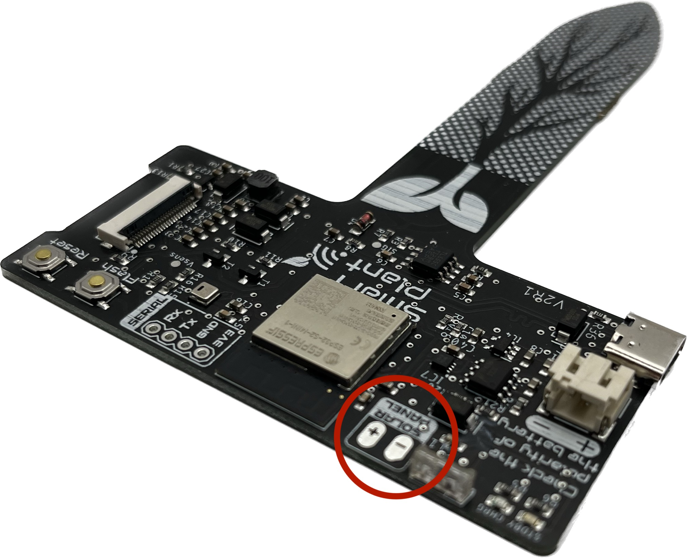

💡 Getting started
===============

Assembly 
----------
Due to the high amount of components integrated in such small PCB layout, most of them are too small to be soldered at home by you. Therefore, these boards come already 
with the components assembled. 

The |Product|, in addition to the PCB assembled board, consist on the following parts:

- A 2.9" e-paper display. The recommend (and tested working) e-ink panel is the `296x128, 2.9inch E-Ink raw display panel <https://www.waveshare.com/product/2.9inch-e-paper.htm>`_ that you can order directly on the manufacturer. 
  Please note that **other displays may not work at all**.
- A :term:`LiPo` battery, with a recommended 1000mAh capacity, for space and power. The ideal dimensions shouldn't excess the 50x34x5mm in order to fit in the designed enclosure.
- An enclosure where to fit the |Product| upper part that you can find on the :ref:`enclosure` section.
- Optionally, you can mount a solar panel that charges the battery under the right sunny conditions. The output voltage of the panel musn't excess the 6V and the recommended size to fit in the designed enclosure is 80x45mm

Powering
--------
The |Product| is be powered through a :term:`LiPo` battery plugged into the white JST connector. The voltage of the battery is regulated to the working 3.3V through a low-consumption LDO.

.. Caution::
    Connect the battery after clamping the e-paper connector and be careful when plugging it or removing it, since the connector can collide with some SMD components.

In order to charge the battery, there is a battery management IC that provides the right charging curve to the :term:`LiPo` battery and offers a visual indicator (red LED for charging, 
green LED for standby) while the battery is being charged. There are two ways of charging the |Product|: USB-C or solar panel.

Solar panel
^^^^^^^^^^^^^

    
In addition to the USB-C, and with the aim of extending the service time between (USB) charges of the battery, the |Product| can be configured to be powered from a solar panel. This version is not the default one, and 
would imply soldering the solar pannel to the board as indicated in the figure.

USB-C
^^^^^^^^^^^^^
The USB Type-C is a very extended port for portable electronics, and because of it's standarized 5V power supply is ideal for charging the |Product| since the battery management IC is designed 
to charge a 1000mAh.

Sensors
--------
.. figure:: ../../Documentation/Images/SP_Top.png
    :align: right
    :figwidth: 200px
    
As the |Product| is intended to work during long periods of time without having to be recharged, it is important to avoid undesired consumptions 
durint the deep-sleep periods. This implies that the sensors have to be powered **only** when they are needed. 

Therefore there is a high-switch circuit that enables/disables the powering of the *sensors power line* connected to the microcontroller's output **GPIO16**.

Regarding the sensors, and except for the soil moisture sensor which is analog, the rest (illuminance, temperature & humidity, battery status) are :term:`IIC` (:math:`I^2C`) sensors,
which are physically defined with the following pinout:

:SDA: **GPIO33**
:SCL: **GPIO34**

Soil moisture
^^^^^^^^^^^^^^

    
Since the |Product| can be directly inserted into the soil of your pot, the area inserted contains a printed circuit that behaves as a 
probe that measures the soil capacity, determined by the soil moisture. As it has no metallic electrodes, there is no risk of probe degradation 
with time. 

The moisture level, in a 0-3.3V range, is measured through the ADC on **GPIO1**

Light sensor
^^^^^^^^^^^^^^^^^^^^^^^
The illuminance is measured through a digital sensor VEML7700-TR. This sensor is located facing the outside of the top part of the board, so it 
would be facing the sky. 

The VEML7700 is quite a convenient sensor since it delivers the values directly in lux. 
The sensor has 16-bit dynamic range for ambient light detection from 0 lux to about 120k lux with resolution down to 0.0036 lx/ct, 
with software-adjustable gain and integration times.

The :math:`I^2C` address is **0x10**.

.. Hint::
    If you are designing your own enclosure, make sure there is a hole for the light sensor on the case.

Ambient temperature & humidity 
^^^^^^^^^^^^^^^^^^^^^^^^^^^^^^^

The |Product| embeds an AHT20 temperature and humidity sensor ready to deliver calibrated data through the :math:`I^2C` bus.

This sensor has an operational relative humidity range of 0 to 100% ( with a +-3 % typical accuracy), and a temperature range of -40 to 85 °C (+-1 °C typical accuracy)

The :math:`I^2C` address is **0x38**.

Battery level
^^^^^^^^^^^^^^^^
For measuring the battery level, the |Product| integrates the MAX17048 :term:`IC`.

This sensor measures the voltage of the LiPo cell and does the math to get an estimative percentage of the battery level.

The :math:`I^2C` address is **0x38**.

E-paper
--------
    
The e-ink display pinout with respect to the ESP32 GPIOs goes as follows:

.. list-table:: Pinout table
    :widths: 10 10 
    :header-rows: 1

    * - ESP32
      - E-paper
    * - 14
      - BUSY
    * - 15
      - RST
    * - 13
      - DC/MISO
    * - 12
      - CLK
    * - 11
      - MOSI
    * - 10
      - CS

Enclosure
---------
The |Product| PCB can be mounted in a custom :ref:`enclosure` that you can print on your own 3D printer.