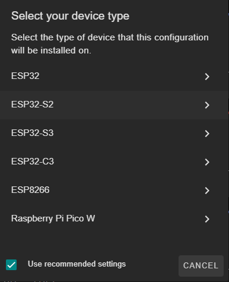
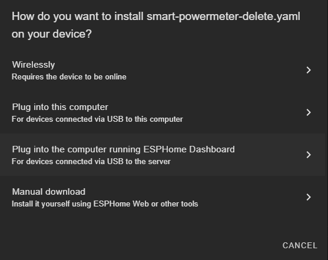
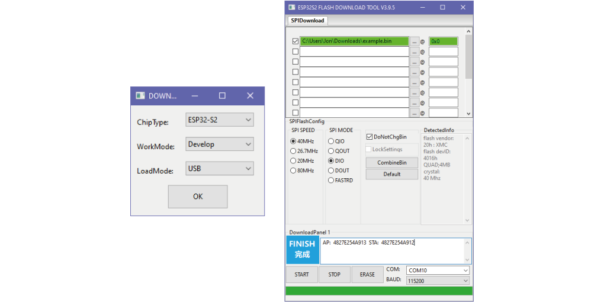

💻 Programming
===============

There are two main programming methods supported and tested with the |Product|: 

 * ESPHome
 * Arduino

.. _flashing:
In both scenarios, and if you are using the USB port or the Serial port for programming it, you
will first need to enter the board into flashing mode: press and hold the *Flash* pushbutton
while you reset the board (pressing once the *Reset* pushbutton).

.. Caution::
    When flashing the board, make sure its only powered by the USB/Serial port.
ESPHome
---------
`ESPHome <https://esphome.io>`_ is a well known platform for programming ESP-based devices 
with a very little effort. It is configured via YAML files and supports a wide range of functionalities
and sensors.

.. Important::
    For using ESPHome, and all its funcionalities, you need to have a `Home Assistant <https://www.home-assistant.io>`_ instance running
    in the same network as your |Product|.

    
The |Product| comes raw, without any firmware by default, therefore, you will need to flash it for first time. There are many ways to flash 
your ESPHome device (`locally <https://esphome.io/guides/getting_started_command_line.html>`_, `ESPHome Web <https://web.esphome.io>`_), but 
the one I strongly recommend is the one through the `ESPHome Add-on for Home Assistant <https://esphome.io/guides/getting_started_hassio.html>`_:

Before starting, please note that, since at the moment there are two external components not integrated natively on ESPHome (the light sensor ``VEML7700`` and the battery monitor ``MAX17048``), the working tree in ESPHome should look like this:

| esphome
| ├── libraries
| │   └── MAX17048.h
| │   └── VEML7700.h
| └── smart-plant.yaml
| 

And you can find these two files from here: 

- :download:`VEML7700<files/VEML7700.h>`
- :download:`MAX17048<files/MAX17048.h>`

With these to files, you can proceed with the setting up:

1. Make sure your ESPHome Add-on for HA is up to date and working. 
2. Add a new device, enter the name you want (like *Smart-Plant*), and skip the next step.
3. Select the *ESP32-S2* as the device type, skip the last step (installation). You will have created a provisional first configuration YAML file.

4. Open the recently created file and replace the content with the example configuration ``smart-plant.yaml``

.. Note:: You might need to keep the encription keys *OTA* and *API*

.. literalinclude:: files/configuration.yaml
   :language: yaml
   :linenos:

.. Important:: 
    Note that with this example code, the Smart Plant enters into deep-sleep mode if the battery level is under 4.15V (lines 363-383), so be aware that if you want to flash it :term:`OTA`, make sure the battery is fully charged or the Smart Plant powered via USB-C.

    
.. Note::
    ``Lemon_tree_label_page_1.png`` is the background image that will be displayed on the e-paper. For having always a styled background image, I made a `python script <https://github.com/JGAguado/Label-maker>`_ that generates the image of the plant, the title and the parameter 
    gauges out of a JSON config file. Alternativelly, you can use any photo editor of your choice, but keep in mind the display size 
    (296x128 pixel) and the center of each gauges (indicated in the YAML code). In this example, it is obtained from an URL, but you can upload yours locally following the `ESPHome guide <https://esphome.io/components/display/index.html#images>`_

    .. image:: images/programming/Lemon_tree_label_page_1.png
        :width: 150px

5. Click on install, make sure that the the board is connected via the USB-C (and into `flashing`_ mode ) to the device running the Home Assistant (in my case a Raspberry Pi) before selecting the mode of installation.

6. Select the Serial port and let it run, it might take some minutes. 
7. Once it's done, you will have to exit the flashing mode: press the *Reset* pushbutton once. 

Now, your ESPHome-based |Product| should be ready to log data and stream it to your Home Assistant. Note that the current configuration is just an example and you can customize it at your will, including the calibration. 

.. Tip::
    A very easy way to upload and copy files (code or even images) into your ESPHome folder hosted in your HA instance is 
    with the help of the Visual Studio Code integration for HA. This way you can just drag and drop the files over the folder 
    on the Home Assistant’s Visual Studio Code navigation panel on your left.

Flash Tools
^^^^^^^^^^^^
If you want to deploy an ESPHome already compiled *.bin* image, you can use Espressif's official `Flash Download Tools <https://www.espressif.com/en/support/download/other-tools>`_ to upload it into your Smart Powermeter. 
As an example (and test) you can use this :download:`smart-areca-v2r1-offline.bin <files/smart-areca-v2r1-offline.bin>` image with the address `0x0`, make sure `DoNotChgBin` is checked:

Arduino
--------
If you are still interested in programming directly with the Arduino IDE, the procedure is no 
different than with any other ESP32 devices:

1. Open the Arduino IDE and go to File -> Preferences option.
2. Add to the *Additional Boards Manager URSLs* the url:

.. parsed-literal::

    https://raw.githubusercontent.com/espressif/arduino-esp32/gh-pages/package_esp32_index.json

3. Close the preferences and open in the menu Tools -> Board -> Boards Manager.
4. Search for *esp32* and install it. This might take some time.
5. Now you can select the board *ESP32 Dev Module* as the target board. Leave the rest of parameters 
   by default.
6. Select the correct port and remember to enter the board into flashing mode before uploading the sketch.

