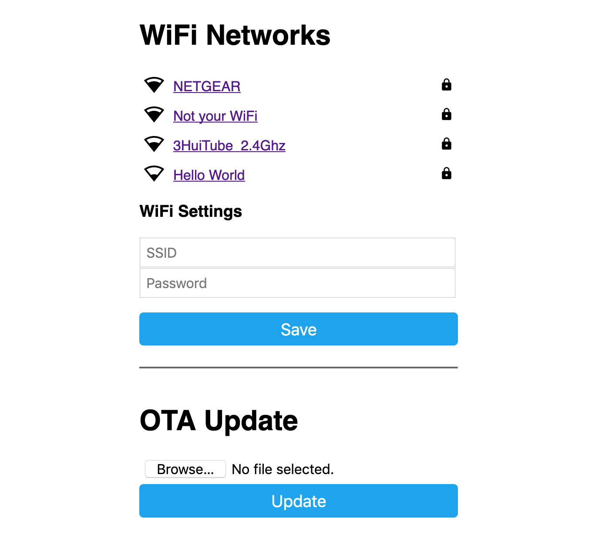

Programming
===========

There are two main programming methods supported and tested with the |Product|: 
 * ESPHome
 * Arduino

In both scenarios, you will first need to enter the board into flashing mode. For that, press and hold the *Flash* pushbutton
while you reset the board (pressing once the *Reset* pushbutton).

.. Note::
    For flashing new firmwares, if the :term:`OTA` support is not available, you can use the USB-C or the serial port (3.3, GND, Tx, Rx).

.. Caution::
    If you decide to flash the board through the serial port, make sure to unplug the battery before (the 3.3V supply is shared).
    

.. _esphome:
ESPHome
---------
`ESPHome <https://esphome.io>`_ is a well known platform for programming ESP-based devices 
with a very little effort. It is configured via YAML files and supports a wide range of functionalities
and sensors.

.. Important::
    For using ESPHome, and all its funcionalities, you need to have a `Home Assistant <https://www.home-assistant.io>`_ (HA) instance running
    in the same network as your |Product|.

.. Tip::
    A very easy way to upload and copy files (code or even images) into your ESPHome folder hosted in your HA instance is 
    with the help of the Visual Studio Code integration for HA. This way you can just drag and drop the files over the folder 
    on the Home Assistant’s Visual Studio Code navigation panel on your left.

    
The |Product| already comes with an embeded version of ESPHome, that would only require an :term:`OTA` update
to get it ready to work in your network:

1. Power the board, and let it run for 1-2 minutes. When the board cannot connect to a WiFi network, it will 
   create a fallback hotspot.
2. Use a smartphone or tablet and go to the WiFi settings, connect to the recently created *Smart-Plant* hotspot with the password *smartplant*.
3. Access to the captive portal and open the browser if doesn't pop up automatically.
4. Enter your network setttings and press *Save*.

Now, your ESPHome device is ready to be found by Home Assistant in your network. Add it from the ESPHome section to add 
and edit a customized configuration file.

As an example of such configuration setup (and the one flashed on the factory settings of the |Product|) 
with all the dependencies:

| esphome
| ├── fonts
| │   └── materialdesignicons-webfont_5.9.55.ttf
| ├── libraries
| │   └── icon-map.h
| │   └── MAX17048.h
| │   └── VEML7700.h
| ├── Lemon_tree_label_page_1.png
| └── smart-plant.yaml
| 
| 
    

In the folder structure above:

``materialdesignicons-webfont_5.9.55.ttf`` 
    As with the previous file, this is a file containing a set of the icons fonts (the battery voltage level). 
    
    In this case I used :term:`MDI` from `google <https://github.com/google/material-design-icons/blob/master/font/MaterialIcons-Regular.ttf>`_
    (version 5.9.55), but shouldn't be any problem to look for the latest. 

``icon-map.h`` 
    This *mapping* file is used to associate a variable name with the *icon ID* from the previous file. It contains the following code:
  
.. code-block:: C
   :linenos:

   #include <map>
   std::map<int, std::string> battery_icon_map
   {
    {0, "\U000F10CD"},
    {1, "\U000F007A"},
    {2, "\U000F007B"},
    {3, "\U000F007C"},
    {4, "\U000F007D"},
    {5, "\U000F007E"},
    {6, "\U000F007F"},
    {7, "\U000F0080"},
    {8, "\U000F0081"},
    {9, "\U000F0082"},
    {10, "\U000F0079"},
   };

``Lemon_tree_label_page_1.png``
    This is the background image that will be displayed on the e-paper. For having always a styled background image, I made a 
    `python script <https://github.com/JGAguado/Label-maker>`_ that generates the image of the plant, the title and the parameter 
    gauges out of a JSON config file. Alternativelly, you can use any photo editor of your choice, but keep in mind the display size 
    (296x128 pixel) and the center of each gauges (indicated in the YAML code).

    .. image:: images/programming/Lemon_tree_label_page_1.png
        :width: 50%

``MAX17048``
    This is the library to read the MAX17048 sensor (battery level):

    .. literalinclude:: files/MAX17048.h
        :language: C
        :linenos:

``VEML7700``
    This is the library to read the VEML7700 light sensor :

    .. literalinclude:: files/VEML7700.h
        :language: C
        :linenos:

``smart-plant.yaml``
    This is the YAML configuration file, the most important file that configures your ESPHome-based SmartPlant:

    .. literalinclude:: files/configuration.yaml
        :language: yaml
        :linenos:

Arduino
--------
If you are still interested in programming directly with the Arduino IDE, the procedure is no 
different than with any other ESP32 devices:

1. Open the Arduino IDE and go to File -> Preferences option.
2. Add to the *Additional Boards Manager URSLs* the url:

.. parsed-literal::

    https://raw.githubusercontent.com/espressif/arduino-esp32/gh-pages/package_esp32_index.json

3. Close the preferences and open in the menu Tools -> Board -> Boards Manager.
4. Search for *esp32* and install it. This might take some time.
5. Now you can select the board *ESP32 Dev Module* as the target board. Leave the rest of parameters 
   by default.
6. Select the correct port and remember to enter the board into flashing mode before uploading the sketch.

